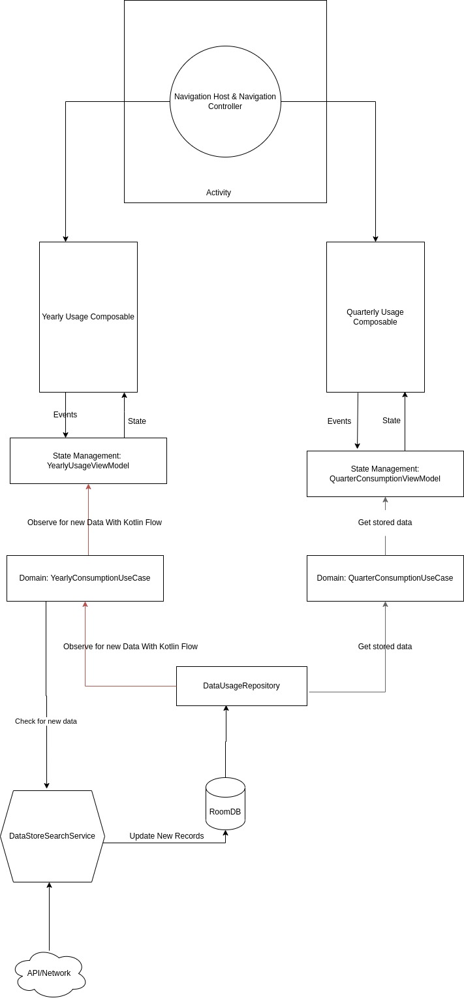

# SGData
Retrieve and Show data yearly and quarterly basis.

## Architecture Overview

## Note
This bug in Compose viewpager causes crash when the quarterley data scrolled faster
https://issuetracker.google.com/issues/218668336?pli=1

## Technologies
Android Archiecture: MVVM  
Observables : Kotlin Flow  
Composable state management: ViewModel [link](https://developer.android.com/jetpack/compose/state)  
Caching: RoomDB  
Consume REST API: Retrofit with Kotlin Coroutines  
Dependency Injection: Dagger Hilt  
Unit test: Junit  

